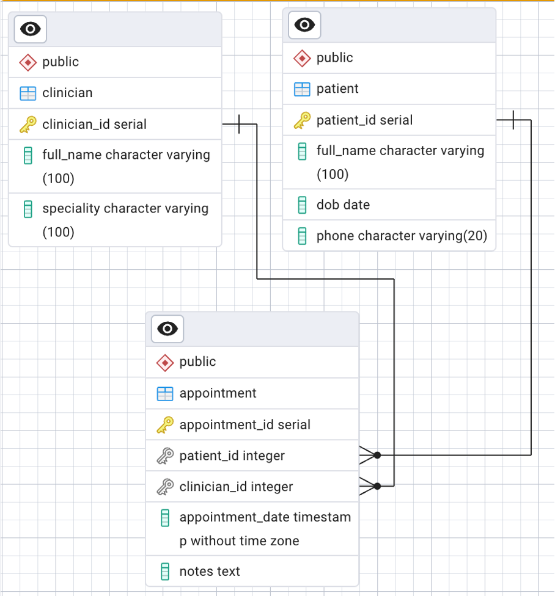
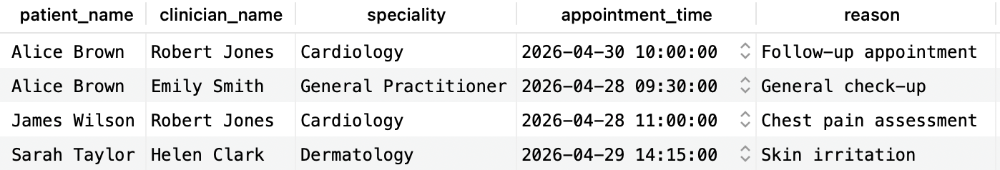
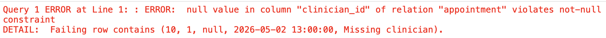
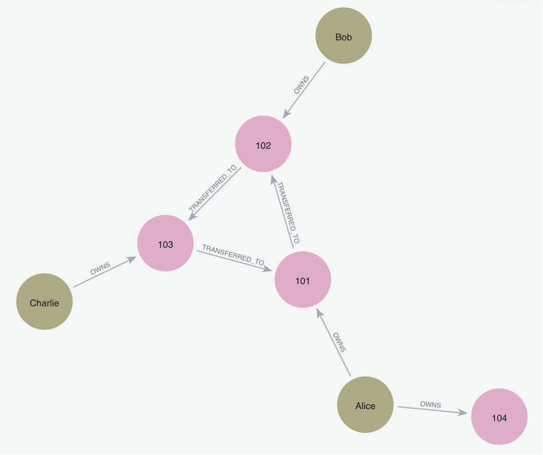
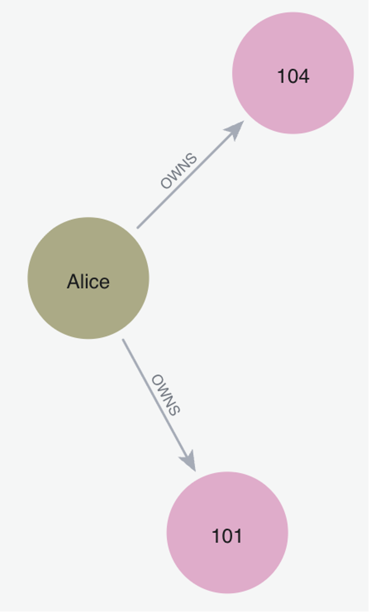
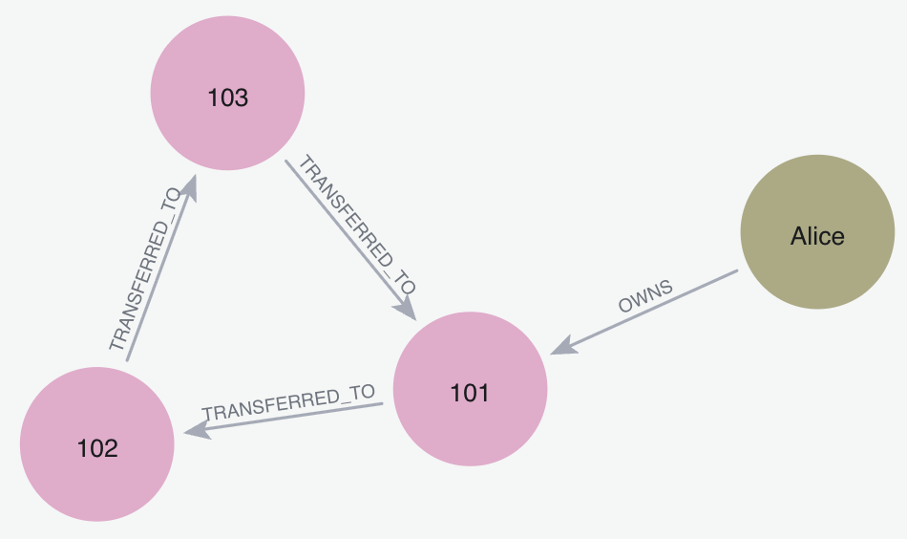
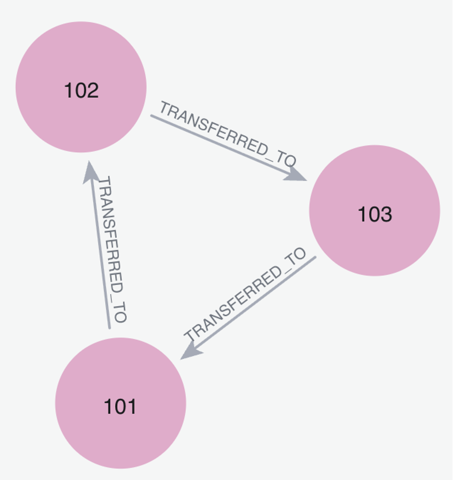
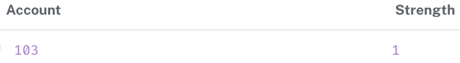

# Relational and Graph Database Analytics Project

This project demonstrates the design and implementation of both relational and graph database systems through real-world applications using PostgreSQL and Neo4j.

The project contains:

- An Electronic Health Record (EHR) relational database implemented in PostgreSQL
- A banking fraud detection graph database implemented in Neo4j

The work demonstrates relational schema design, SQL querying, ACID-compliant transactions, graph traversal, and fraud pattern analysis.

---

## Technologies Used

- PostgreSQL
- Neo4j
- SQL
- Cypher
- Git/GitHub

---

## Project Structure

```text
sql/
neo4j/
diagrams/
screenshots/
report/
```

---

## PostgreSQL Implementation

The PostgreSQL section models an Electronic Health Record (EHR) system containing:

- Patients
- Clinicians
- Appointments

Features demonstrated include:

- Relational schema design
- Primary and foreign keys
- Multi-table JOIN queries
- ACID-compliant transactions
- Constraint validation
- Referential integrity

### Entity Relationship Diagram



---

## SQL Example Outputs

### JOIN Query Output



### Transaction Rollback Example


### Constraint Violation Example



---

## Neo4j Implementation

The Neo4j section models a banking fraud detection system using graph databases.

The graph structure contains:

- Person nodes
- Account nodes
- OWNS relationships
- TRANSFERRED_TO relationships

Features demonstrated include:

- Graph traversal
- Pattern matching
- Variable-length traversals
- Circular transaction detection
- Indirect relationship ranking
- Cartesian product warnings and query optimisation

---

## Neo4j Example Outputs

### Graph Structure



### One-step Traversal



### Variable-length Traversal



### Circular Pattern Detection



### Indirect Connection Ranking



---

## Running the Project

### PostgreSQL Setup

Run the SQL files in the following order:

```text
1. schema.sql
2. insert_data.sql
3. basic_query.sql
4. join_query.sql
5. transaction_rollback.sql
6. constraint_violation.sql
```

### Neo4j Setup

Run the Cypher files in the following order:

```text
1. clear_database.cypher
2. create_nodes.cypher
3. create_relationships.cypher
4. cartesian_product_example.cypher
5. one_step_traversal.cypher
6. extended_traversal.cypher
7. two_step_traversal.cypher
8. variable_length_traversal.cypher
9. circular_pattern_detection.cypher
10. circular_pattern_detection_distinct.cypher
11. indirect_connection_ranking.cypher
```

---

## Report

📄 [View Full Report (PDF)](report/database_assignment_report.pdf)

---

## Author

William West
University of Huddersfield
